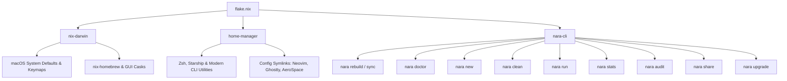

<div align="center">

# ❄️ `.dotfiles`

**Declarative, Reproducible macOS System Architecture & Custom Tooling**

[](https://github.com/nix-darwin/nix-darwin)
[](https://github.com/nix-community/home-manager)
[](https://go.dev/)
[](https://apple.com)

*A fully declarative macOS workstation setup engineered with Nix Flakes, Home Manager, nix-homebrew, and `nara-cli`—a bespoke Go-based workflow engine.*

</div>

---

## 📌 Table of Contents

- [Overview](#-overview)
- [System Architecture](#-system-architecture)
- [nara-cli Workflow Engine](#-nara-cli-workflow-engine)
- [Software & Tooling Stack](#-software--tooling-stack)
- [Installation & Bootstrapping](#-installation--bootstrapping)
- [Project Templates](#-project-templates)
- [Repository Structure](#-repository-structure)

---

## 🔍 Overview

This repository contains the complete configuration for my personal Apple Silicon Mac environment. Every application, macOS setting, shell utility, and project template is declared immutably using **Nix Flakes**.

### Key Highlights
* **Zero Imperative Drift**: Rebuilding the configuration enforces the exact state across system defaults, user packages, and shell aliases.
* **Bespoke Go CLI (`nara-cli`)**: Custom CLI built to automate permission fixes, system rebuilds, diagnostics, and workspace scaffolding.
* **Automated Dev Environments**: Pre-configured `direnv` + `nix-direnv` integration for instant, zero-pollution per-directory development shells.

---

## 🏗️ System Architecture



---

## ⚡ `nara-cli` Workflow Engine

`nara` is a high-performance CLI written in Go to eliminate boilerplate commands and maintain environment health.

### Commands Reference

| Command | Usage | Description |
| :--- | :--- | :--- |
| `rebuild` / `sync` | `nara rebuild` | Automatically fixes `.git` permissions, stages changes, and executes `darwin-rebuild switch`. |
| `upgrade` | `nara upgrade` | Full system update: updates Nix flake locks, upgrades Homebrew casks, rebuilds, & cleans. |
| `doctor` | `nara doctor` | Runs diagnostic health checks on `$PATH` binaries, user ID permissions, and environment variables. |
| `new` | `nara new <app>` | Scaffolds a new project directory using the default Nix Flake template, initializes Git, and enables `direnv`. |
| `clean` | `nara clean [--all]` | Performs garbage collection on old Nix generations and executes `nix store optimise` to hard-link duplicate files. |
| `run` | `nara run <pkg>` | Runs any package from `nixpkgs` ephemerally on-demand without installing it. |
| `stats` | `nara stats` | Displays a colorful ASCII system, Nix store size, and Git status dashboard. |
| `audit` | `nara audit` | Scans macOS battery status, top CPU/RAM hogs, and active Homebrew services. |
| `share` | `nara share [file]` | Serves files/folders over Wi-Fi with chunked HTTP byte-range streaming & terminal QR codes. |
| `version` | `nara version` | Prints current `nara-cli` release version. |

### Compiling & Installing `nara-cli`
```bash
cd ~/.dotfiles/nara-cli
go build -o ~/.local/bin/nara main.go
```

---

## 💻 Software & Tooling Stack

### Core System & Window Management
* **Window Manager**: [AeroSpace](https://github.com/nikitabobko/AeroSpace) (Tiling Window Manager for macOS)
* **Terminal Emulator**: [Ghostty](https://ghostty.org/)
* **Launcher**: [Raycast](https://www.raycast.com/)
* **Container Runtime**: [OrbStack](https://orbstack.dev/)

### Modern Shell & CLI Utilities
* **Shell**: Zsh configured via Home Manager with `autosuggestions`, `syntax-highlighting`, and `history-substring-search`.
* **Prompt**: [Starship](https://starship.rs/)
* **File & Text Navigation**:
  * `eza` — Modern, colorized `ls` replacement with git status integration.
  * `bat` — Syntax-highlighted `cat` replacement with line numbering.
  * `zoxide` — Smart `cd` alternative powered by frecency algorithm.
  * `fzf` — Fuzzy finder with native Zsh keybindings (`Ctrl+R`, `Ctrl+T`).
  * `yazi` — Blazing-fast terminal file manager written in Rust.
  * `ripgrep` & `fd` — Fast file content and path search utilities.
  * `lazygit` — Terminal UI for Git commands.

---

## 🚀 Installation & Bootstrapping

To set up a fresh macOS machine with this configuration:

### 1. Clone Repository
```bash
git clone https://github.com/Aneeshie/dotfiles.git ~/.dotfiles
cd ~/.dotfiles
```

### 2. Execute Bootstrap Rebuild
```bash
./rebuild.sh
```

### 3. Build & Install `nara-cli`
```bash
cd ~/.dotfiles/nara-cli
go build -o ~/.local/bin/nara main.go
```

---

## 📦 Project Templates

This repository exposes Nix Flake templates for rapid workspace initialization.

To initialize a new development workspace manually:
```bash
nix flake init -t ~/.dotfiles
```

Or instantly via `nara-cli`:
```bash
nara new my-awesome-project
```

---

## 📂 Repository Structure

```
.dotfiles/
├── configuration.nix      # macOS system defaults, hidutil keymaps & Homebrew casks
├── home.nix               # Home Manager configuration, CLI utilities & dotfiles symlinks
├── flake.nix              # Main Nix Flake definition & exported project templates
├── rebuild.sh             # Initial system bootstrap shell script
├── templates/             # Flake templates for new workspaces
│   └── default/           # Default devShell & .envrc template
└── nara-cli/              # Custom Go CLI workflow tool
    ├── main.go            # Entry point & subcommand router
    ├── go.mod             # Go module definition
    └── cmd/               # Subcommand implementations
        ├── rebuild.go     # `nara rebuild` logic
        ├── doctor.go      # `nara doctor` diagnostic suite
        ├── new.go         # `nara new` scaffolding engine
        ├── clean.go       # `nara clean` Nix storage optimizer
        ├── run.go         # `nara run` ephemeral package runner
        ├── stats.go       # `nara stats` system dashboard
        ├── audit.go       # `nara audit` performance & battery scanner
        ├── share.go       # `nara share` local Wi-Fi file server & QR code generator
        └── upgrade.go     # `nara upgrade` full macOS system update pipeline
```

---

<div align="center">

Crafted with ❤️ by **Aneeshie**

</div>
